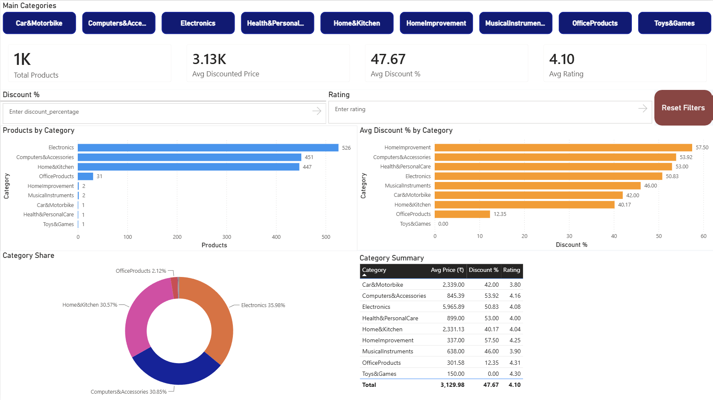
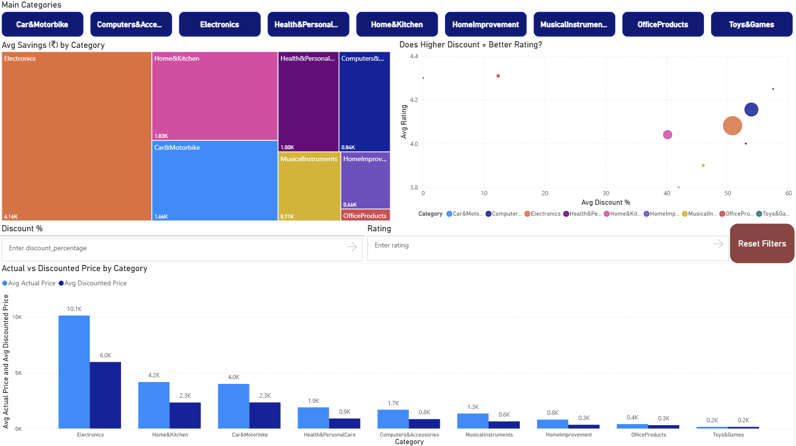
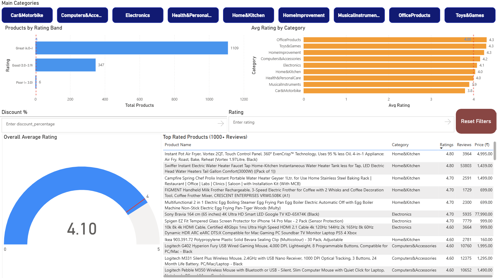

# 📦 Amazon India Sales Dashboard | Power BI

An interactive product analytics dashboard built on Amazon India sales data (1,462 products across 9 categories), analyzing pricing, discounts, and customer ratings to surface actionable business insights.

---

## 📊 Dashboard Preview







### 🎬 Interactive Demo


---

## 🎯 Business Questions Answered

- Which product categories have the most products and highest discounts?
- Do heavily discounted products actually receive better customer ratings?
- Which categories deliver the highest savings (₹) to customers?
- What is the overall rating health across Amazon India's product catalog?
- Which specific products have the best ratings with significant review volume?

---

## 💡 Key Insights

- **Electronics dominates** the catalog with 526 products (35.98% of total) and the highest average savings of ₹4,160 per product — the biggest value category for customers
- **HomeImprovement offers the steepest discounts** (avg 57.5%) while **OfficeProducts has the lowest** (avg 12.35%), suggesting very different pricing strategies across categories
- **Higher discounts do NOT guarantee better ratings** — OfficeProducts has the lowest discount (12.35%) yet the highest avg rating (4.3), while heavily discounted categories sit around 4.0–4.1
- **75% of products (1,109 out of 1,462) are rated Great (4.0+)** — only 6 products fall below 3.0, indicating strong overall product quality on the platform
- **Electronics has the highest avg MRP** at ₹5,965 vs a discounted price of ₹5,965 — the largest absolute price gap of any category
- **Home&Kitchen leads in top-rated products** with high review counts (53,803 reviews for one water heater product), showing strong customer engagement

---

## 🔧 Tools & Technologies

| Tool | Purpose |
|---|---|
| Python (pandas) | Data cleaning & preprocessing |
| Power BI Desktop | Data modeling, DAX measures, dashboard |
| Power Query (M) | Data transformation |
| DAX | Custom measures and calculated columns |
| GitHub | Version control and portfolio publishing |

---

## 📁 Dataset

**Source:** [Amazon India Sales Dataset — Kaggle](https://www.kaggle.com/datasets/karkavelrajaj/amazon-sales-dataset)

- 1,465 raw records → 1,462 after cleaning
- 16 raw columns → 11 clean columns
- Indian ₹ pricing across 9 product categories
- Includes actual price, discounted price, discount %, ratings, and review counts

---

## 🧱 Project Approach

### Step 1 — Data Cleaning (Python)
- Removed ₹ symbol and commas from price columns → converted to float
- Removed % symbol from discount column → converted to int
- Handled nulls in rating and rating_count columns (3 rows dropped)
- Split pipe-delimited category column into `Main_Category` and `Sub_Category`
- Engineered `savings_amount` column (actual_price − discounted_price)
- Dropped 7 non-analytical columns (reviews, image links, user IDs)

### Step 2 — Data Modeling (Power BI)
- Loaded cleaned CSV directly — no further Power Query transformation needed
- Created 9 DAX measures: Total Products, Avg Discounted Price, Avg Actual Price, Avg Discount %, Avg Rating, Total Ratings, Avg Savings, High Discount Products, Top Rated Products
- Created 3 helper measures for Gauge visual: Min Rating, Max Rating, Target Rating
- Created `Rating_Band` calculated column to group products into Great / Good / Poor tiers

### Step 3 — Dashboard Design (3 Pages + Drill-Through)

**Page 1 — Overview**
- KPI cards: Total Products, Avg Price, Avg Discount %, Avg Rating
- Products by Category (bar chart)
- Avg Discount % by Category (bar chart)
- Category Share (donut chart)
- Category Summary (table)

**Page 2 — Pricing & Discounts**
- Avg Savings by Category (treemap)
- Does Higher Discount = Better Rating? (scatter chart)
- Actual vs Discounted Price by Category (clustered column chart)

**Page 3 — Ratings Analysis**
- Products by Rating Band (bar chart)
- Avg Rating by Category with 4.0 target line (bar chart)
- Overall Avg Rating (gauge)
- Top Rated Products — 1000+ reviews only (table)

**Page 4 — Category Detail (Drill-Through)**
- Hidden page — accessible only via drill-through
- Full product-level detail table filtered to selected category
- KPI cards for category-specific metrics

---

## 📌 Interactive Features

| Feature | Description |
|---|---|
| ✅ Button Slicer | Filter all visuals by product category (tile-style clickable buttons) |
| ✅ Range Slicers | Filter by discount % range and rating range |
| ✅ Cross-Filtering | Click any visual to filter all others on the page |
| ✅ Synced Slicers | Category/discount/rating filters apply across all 3 pages simultaneously |
| ✅ Drill-Through | Right-click any category → view product-level detail on hidden page |
| ✅ Back Navigation | Auto-generated back button on drill-through page |
| ✅ Reset Filters | One-click bookmark button to clear all filters on each page |

---

## 📂 Repository Structure

```
amazon-india-sales-dashboard/
├── README.md
├── data/
│   ├── amazon.csv                  ← raw dataset (from Kaggle)
│   └── amazon_cleaned.csv          ← cleaned dataset (Python output)
├── powerbi/
│   └── amazon_sales_dashboard.pbix ← Power BI dashboard file
├── images/
│   ├── page1_overview.png
│   ├── page2_pricing.png
│   ├── page3_ratings.png
│   ├── page4_drillthrough.png
│   └── demo.gif
└── scripts/
    └── data_cleaning.ipynb            ← Python cleaning script
```

---

## 🚀 How to View

1. Download `powerbi/amazon_sales_dashboard.pbix`
2. Open in **Power BI Desktop** (free download from Microsoft)
3. All data is embedded — no additional setup needed
4. Use the category buttons at the top to filter, or right-click any category in the treemap to drill through

---

## 👤 Author

**Shyam Jagani**
MSc Data Science — University of Essex
Google Data Analytics Professional Certificate (2026)

[GitHub](https://github.com/shyamjagani)
[LinkedIn](www.linkedin.com/in/shyam-jagani-356535141)
```
